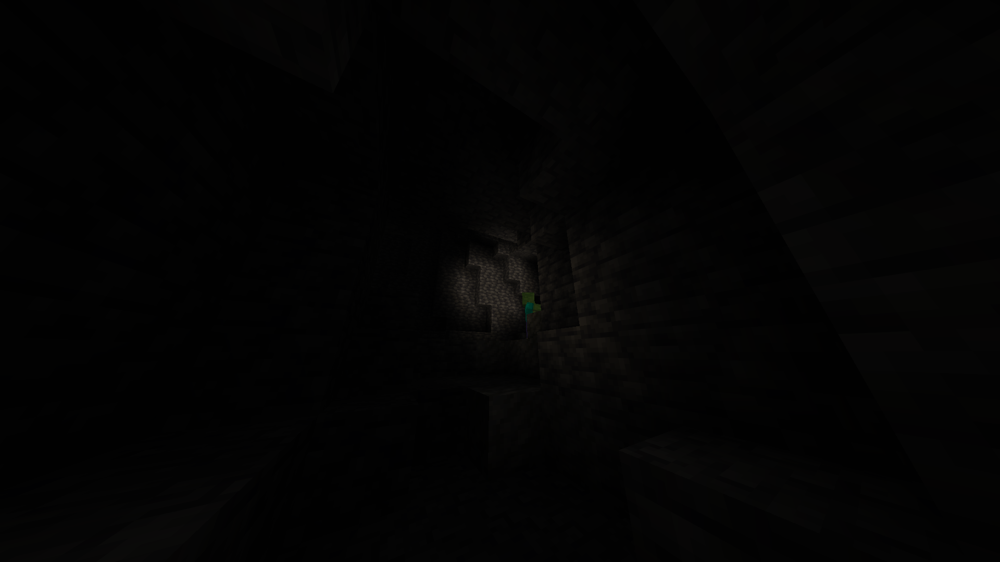
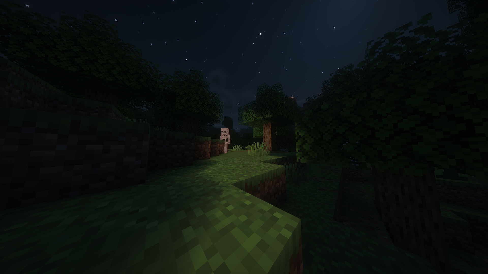
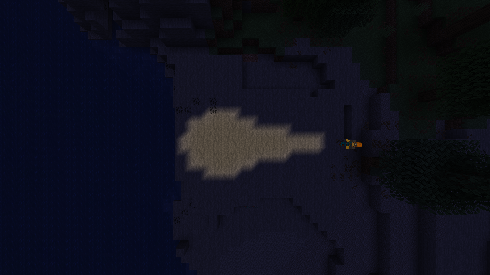

# Drop's Flashlight
A client-side-only Fabric mod that that adds a flashlight to Minecraft.

## On this page
1. [Overview](#overview)
2. [Screenshots](#screenshots)
3. [Installation](#installation)
4. [Supported Minecraft versions and requirements](#supported-minecraft-versions-and-requirements)
5. [License](#license)
6. [Contact](#contact)

## Overview
Are you tired of carrying torches when caving? Fullbright feels like cheating? This mod lets you change that.

Drop's Flashlight is a lightweight client-side-only Fabric mod that adds a flashlight to Minecraft. No server-side installation required! Once you're in-game just press a key (`=` by default) and enjoy a new caving experience.

The light created by the flashlight can only be seen by you. This mod has been tested with [Sodium](https://modrinth.com/mod/sodium) and [Iris Shaders](https://modrinth.com/mod/iris), and it even works with many shader packs.

## Screenshots

### How it looks in-game

### Screenshot with Sodium, Iris Shaders and [Complementary Shaders](https://modrinth.com/shader/complementary-unbound) installed

### Third-person view*

*Other players can't see your flashlight. This picture was taken with a freecam mod to show the pattern the flashlight creates.

## Installation
1. Install the Fabric loader.
2. Install this mod and Fabric API in your `mods` folder.
3. I also suggest installing Sodium for improved performance.

Required Fabric loader versions and Fabric API versions are specified ([here](#supported-minecraft-versions-and-requirements)).

## Supported Minecraft versions and requirements

### Minecraft 26.3
- Required Java version: Java 25 or higher
- Required Fabric loader version: 0.19.5 or higher
- Requires Fabric API to work

### Minecraft 26.2
- Required Java version: Java 25 or higher
- Required Fabric loader version: 0.19.3 or higher 
- Requires Fabric API to work

## License
This project is licensed under the GPL-3.0-only license. See the `LICENSE` file for details.

## Contact
You can contact me by opening an issue on GitHub [here](https://github.com/DropOfAWater/drops-flashlight/issues).

## Links
- [Modrinth Page for Drop's Flashlight](https://modrinth.com/mod/drops-flashlight)